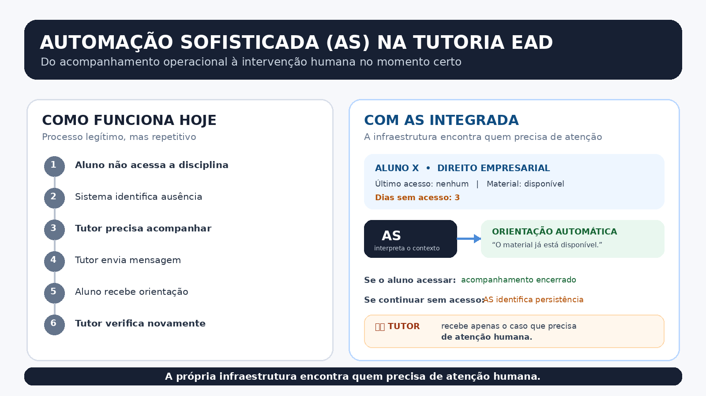
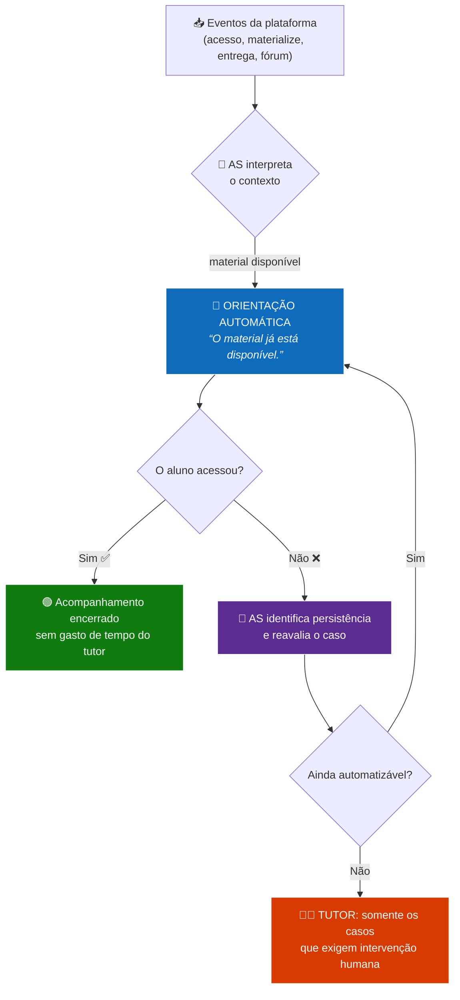

<div align="center">

<picture>
  <source media="(prefers-color-scheme: dark)" srcset="https://capsule-render.vercel.app/api?type=waving&color=0B3C5D&fontSize=44&text=AS%20Acompanhamento%20Inteligente%20EaD&theme=merko">
  
</picture>

<br>

### Automação Sofisticada (AS) na Tutoria EAD

**Do acompanhamento operacional à intervenção humana no momento certo.**

[]()
[]()
[]()
[](https://github.com/sandronsk1977-creator)

</div>

---

## 🖼️ Preview



---

## 📌 O que é

Um **painel operacional de tutoria EaD** inspirado no ecossistema **Microsoft Azure / Entra ID**, onde a automação não substitui o tutor: ela **descobre quem precisa de atenção humana**.

A **AS (Automação Sofisticada)** observa a infraestrutura de aprendizagem, interpreta o contexto de cada aluno e executa a primeira intervenção sozinha. Se o aluno reage, o acompanhamento é encerrado. Se a inatividade persiste, a AS **escala o caso para o tutor**, com todo o histórico já organizado.

> **Ideia principal:** a própria infraestrutura encontra quem precisa de atenção humana.

---

## 😓 Como funciona hoje

Processo legítimo, mas **repetitivo**. O tutor vira um radar humano, varrendo aluno por aluno.

```text
Aluno não acessa a disciplina
          ↓
Sistema identifica a ausência
          ↓
Tutor precisa acompanhar  ← 🔁 trabalho manual
          ↓
Tutor envia mensagem
          ↓
Aluno recebe a orientação
          ↓
Tutor verifica novamente    ← 🔁 e depois?
```

<details>
<summary><b>⏱️ Onde o tempo se perde</b></summary>

- 🔍 Varredura manual de todos os alunos, todos os dias
- 📉 Sinal tardio: a ausência só vira crise depois de vários dias
- 📨 Mensagens repetitivas com baixo valor agregado
- 🔁 Tutor ocupado com casos que se resolveriam sozinhos
- 🎯 Casos críticos diluídos no meio do volume

</details>

---

## ⚡ Com a AS integrada

A infraestrutura **encontra quem precisa de atenção** e a AS **interpreta o contexto**.



### 📋 Caso real: `Aluno X • Direito Empresarial`

| Campo | Valor |
|:---|:---|
| Último acesso | nenhum |
| Material | disponível |
| Dias sem acesso | 3 |

**→ A AS interpreta o contexto**

```text
💬  ORIENTAÇÃO AUTOMÁTICA
    “O material já está disponível.”
```

**→ Se o aluno acessar:** acompanhamento encerrado ✅

**→ Se continuar sem acesso:** a AS identifica a persistência e o tutor recebe **apenas o caso que precisa de atenção humana** 👨‍🏫

---

## 🧭 O painel (estilo Azure / Entra ID)

Interface desenhada sobre a linguagem visual de consoles de nuvem: **densidade informacional, foco no que é acionável e leitura rápida**.

```text
┌──────────────────────────────────────────────────────────────────────┐
│  AS · Tutoria EaD          [ Disciplina ▾ ] [ Período ▾ ] [ 🔍 ]   │
├──────────────────────────────────────────────────────────────────────┤
│  ┌───────────┐  ┌───────────┐  ┌───────────┐  ┌───────────┐        │
│  │ Monitorados│ │ Em risco  │ │  Escalados │ │  Resolvidos│        │
│  │    248     │ │    17     │ │     5      │ │    231     │        │
│  └───────────┘  └───────────┘  └───────────┘  └───────────┘        │
├──────────────────────────────────────────────────────────────────────┤
│  Aluno            Disciplina            Dias   Status      Ação     │
│  ──────────────────────────────────────────────────────────────────  │
│  Aluno X          Direito Empresarial        3   ● Crítico  [Atender] │
│  Aluna Y          Contabilidade Básico       2   ● Atenção [Atender]  │
│  Aluno Z          Gestão de Projetos        1   ● Observ. [Revisar]  │
│  Aluno W          Direito Empresarial        0   ● OK       [Ver]     │
└──────────────────────────────────────────────────────────────────────┘
```

### 🎨 Recursos de interface

- **🧭 Navegação lateral** por disciplina, turma e faixa de risco
- **🔴🟡🟢 Semáforo de status** com severidade consistente em toda a tela
- **🪟 Painel lateral de detalhe** (`drawer`) com timeline completa do aluno
- **📊 Gráficos de acompanhamento**: Engajamento, Retenção e Tempo de resposta
- **🔎 Filtros e busca** por aluno, disciplina, situação e data
- **🏷️ Badges de contexto**: "3º contato", "sem resposta", "prazo próximo"
- **⚡ Ações em lote**: atendimento individual ou agrupado por padrão de caso
- **🌙 Tema claro/escuro** e layout responsivo

---

## 🔁 Como a AS decide

Cada evento alimenta uma **fila de priorização**. A AS só escala quando entende que a automação já não basta.

| Estágio | Ação da AS | Resultado |
|:---:|:---|:---|
| **1. Detecção** | Aluno sem acesso em disciplina ativa | Caso criado |
| **2. Contexto** | Material disponível? prazo? histórico? | Contexto montado |
| **3. Intervenção** | Orientação automática personalizada | Aluno é nudgeado |
| **4. Persistência** | Sem reação após a intervenção | Caso marcado como escalável |
| **5. Handoff** | Encaminhado ao tutor com histórico completo | **Atendimento humano** |

### 🚦 Níveis de severidade

| Nível | Critério | Quem age |
|:---:|:---|:---|
| 🟢 **OK** | Acesso dentro do esperado | Nenhuma |
| 🟡 **Observar** | 1 dia sem acesso | Automação |
| 🟠 **Atenção** | 2 dias ou prazo próximo | Automação + tutor |
| 🔴 **Crítico** | 3+ dias, prazo vencido ou risco de evasão | **Tutor** |

---

## ✨ Funcionalidades

- 📡 **Ingestão de eventos**: acesso, download de material, entrega de tarefa, interação em fóruns
- 🧠 **Motor de contexto**: cruza sinais para montar o retrato completo do aluno
- 💬 **Orientação automática**: mensagens claras, empaticas e contextualizadas
- 🔁 **Detecção de persistência**: distingue “não viu” de “viu e não engiu”
- 👨‍🏫 **Fila do tutor**: priorizada por risco, sem ruído
- 🕘 **Timeline do caso**: cada ação da AS e do tutor registrada e auditável
- 📈 **Painel analítico**: engajamento por disciplina, período e cohort
- 🔌 **Integrações**: LMS, repositório institucional e mensageria
- 🛡️ **Privacidade by design**: minimização de dados e LGPD desde a coleta

---

## 🛠️ Stack tecnológico

| Camada | Tecnologias |
|:---|:---|
| 🎨 **Frontend** | HTML • CSS • JavaScript |
| 📊 **Dashboards** | Componentes no padrão Azure / Entra ID |
| ⚙️ **Automação** | Python • PowerShell • Regras e heurísticas |
| 🔗 **Integrações** | API do LMS • REST • Webhooks |
| 🗂️ **Dados** | SQLite / PostgreSQL • Exportação CSV |

---

## 📁 Estrutura

```text
📂 tutoria_ead
├── README.md                              → Este arquivo
├── automacao_sofisticada_tutoria_ead.png  → Preview do painel
├── index.html                             → Painel principal (protótipo)
├── assets/
│   ├── css/                               → Estilos do painel
│   └── img/                               → Ícones e capturas
└── docs/
    └── regras-as.md                       → Regras de priorização e escalonamento
```

---

## 🚀 Roadmap

- [ ] Protótipo do painel com dados simulados
- [ ] Motor de contexto e regras de severidade
- [ ] Integração com LMS (webhooks de acesso e entrega)
- [ ] Fila de atendimento do tutor com histórico
- [ ] Relatórios de engajamento e evasão
- [ ] Estudo de caso com dados reais (LGPD)

---

## 💡 Por que isso importa

| Antes | Com a AS |
|:---|:---|
| Tutor varre lista manualmente | Infraestrutura varre o campus |
| Contato genérico em massa | Orientação contextualizada |
| Escalonamento tardio | Escalonamento no momento certo |
| Tutor ocupado com ruído | Tutor focado no que só ele resolve |

> 🤖 A automação cuida do volume. 👨‍🏫 O tutor cuida da pessoa.

---

## 📜 Licença

Uso **educacional**: sinta-se livre para usar e modificar para fins de ensino e pesquisa. 🎓

---

## 👨‍💻 Autor

**Sandro Ferreira**: Analista de TI • ITSM • Infraestrutura • Automação

[](https://github.com/sandronsk1977-creator)
[](https://www.linkedin.com/in/sandro-ferreira-5816b4284/)

⭐ Se a AS fez sentido pra você, deixei uma estrela no repositório!
